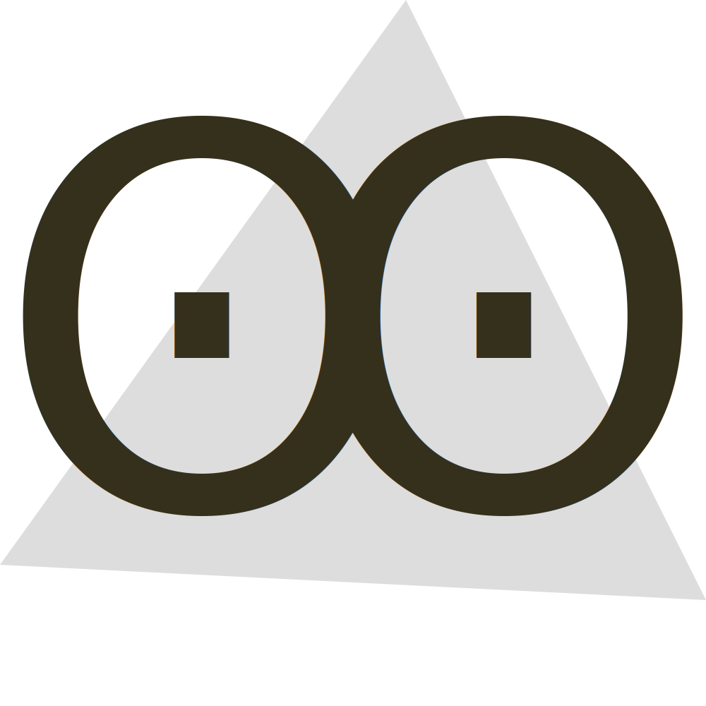
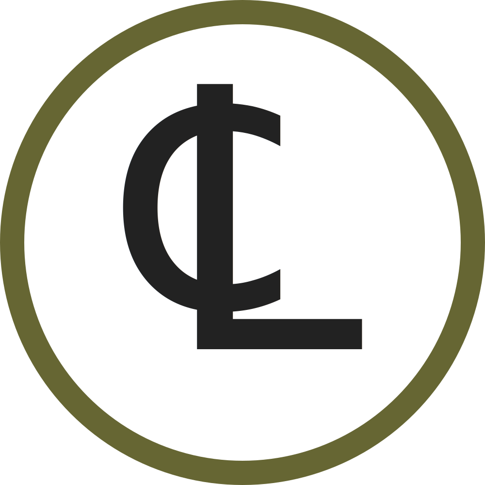
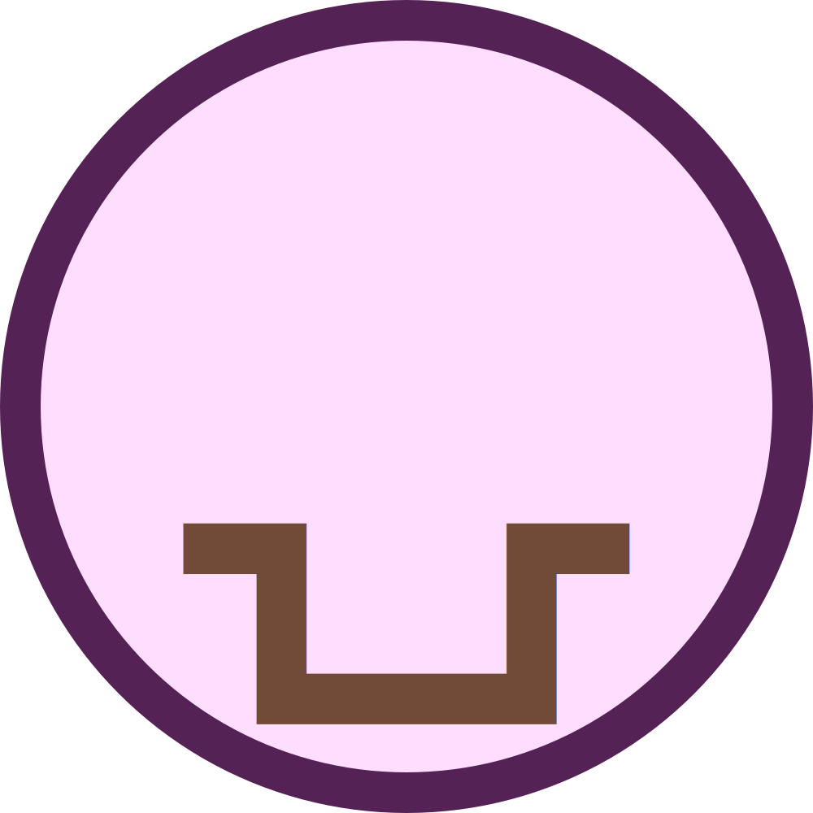
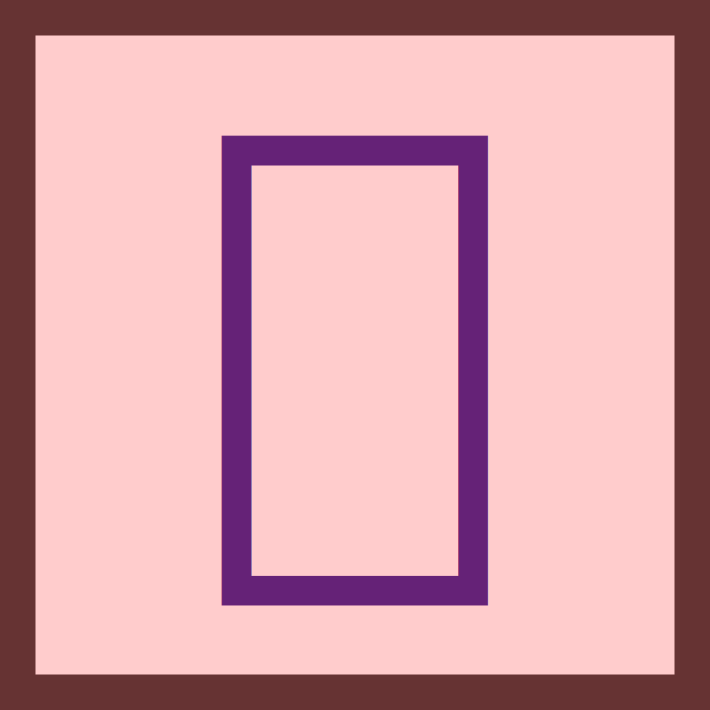
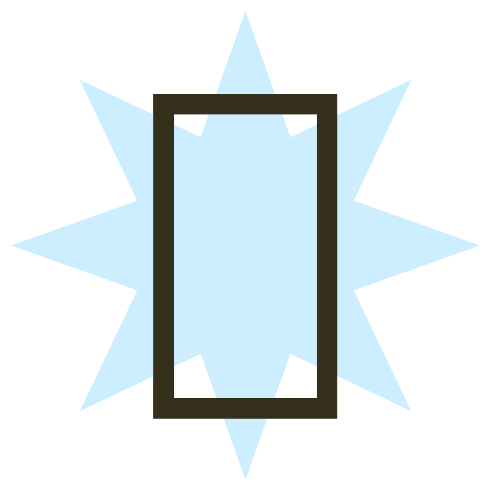
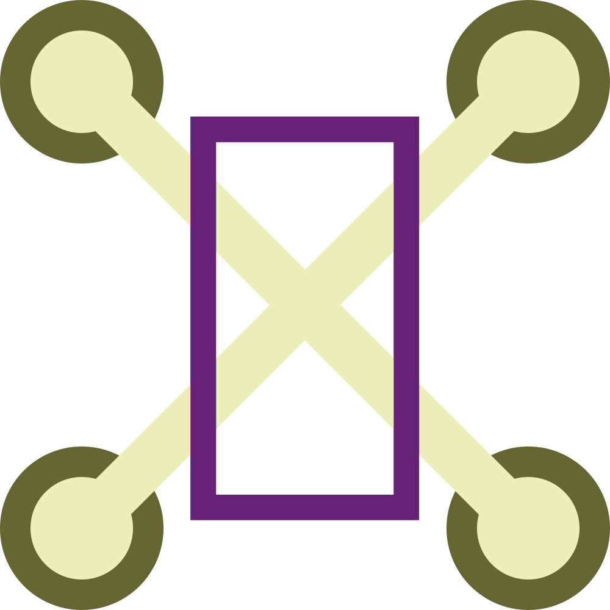

# Glyph Generator
Generates a large number of visually distinct open license images.

After watching [this video by Matt Parker](https://www.youtube.com/watch?v=VTDKqW_GLkw), I was inspired to make my own version of "Myriad Monomatch" using only open-license images.

**Problem:** I need over 10,000 such images to make the cards.

**Solution:** Unicode fonts already contain many visually distinct glyphs. So I multiply several-hundred characters from open fonts with a set of backgrounds I made myself.
Varying colors are added as an extra source of visual distinction, but are not themselves used to distinguish between pips.

## Examples

Here are some examples of output from version 1 of the generator: 

<table><tr><td>

</td></tr></table>

---

## Licensing and Attribution.

### Images
All generated images in this repo are usable under [CC-BY-4.0](https://creativecommons.org/licenses/by/4.0/), 
meaning you can use them in any way you like as long as you provide attribution.  
Copyright 2021 Robert Winslow

_Of course, many of the resulting images are things like 'yellow square with a big S on it', and are too simple to fall under copyright, but attribution would be appreciated nonetheless._

### Color Schemes Used
- [Paul Tol's colorblind friendly color schemes.](https://personal.sron.nl/~pault/)
- [Paul Centore's conversion of Munsell centroids into RGB](https://www.munsellcolourscienceforpainters.com/ISCCNBS/ISCCNBSSystem.html)

### Fonts used

The generated images make use of the following typefaces:
- [Quivira 4.1](http://www.quivira-font.com/), kindly released by Alexander Lange into the public domain 
- [Ma Shen Zheng](https://fonts.google.com/specimen/Ma+Shan+Zheng#glyphs), used under the [Open Font License](https://scripts.sil.org/cms/scripts/page.php?site_id=nrsi&id=OFL)
- Computer Modern by Donald Knuth, used under the [Open Font License](https://scripts.sil.org/cms/scripts/page.php?site_id=nrsi&id=OFL)

