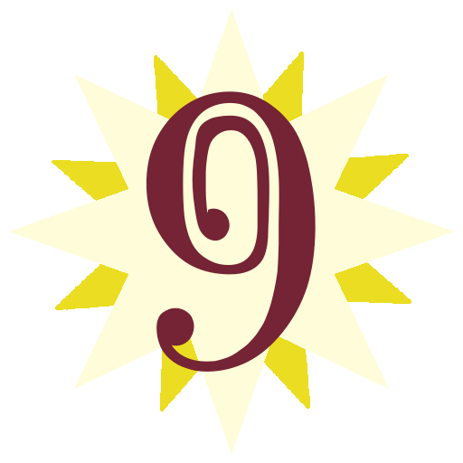
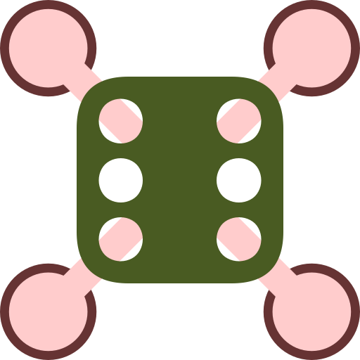

# Simple Open Glyph Set

You can find the generated images in the `mainOutput` folder. Some additional files are included in the `supplemental` folder, including the fonts and janky code used to generate the images.

## Examples

<table><tr><td>

</td></tr></table>

---

## Licensing and Attribution.

### Copyright: public domain.
All generated images in this repo are released into the public domain under [CC0 1.0](https://creativecommons.org/publicdomain/zero/1.0/), 
meaning you can use them in any way you like. Sell them, repost them, remix them, etc. No permission needed. No resttictions whatsoever.

There is no legal obligation to give attribution, but if you make use of these images, attribution would nonetheless be appreciated.
Something like the following in a readme:

> Simple Open Glyph Set by Robert Winslow https://github.com/RobertWinslow/glyph-generator

### Color Schemes Used
- [Paul Tol's colorblind friendly color schemes.](https://personal.sron.nl/~pault/)
- [Paul Centore's conversion of Munsell centroids into RGB](https://www.munsellcolourscienceforpainters.com/ISCCNBS/ISCCNBSSystem.html)

### Fonts used

I've stuck with public domain fonts as the input for this release, and included these fonts in the download.

- Most of the characters come from [Quivira](http://www.quivira-font.com/), by Alexander Lange.
- This set also makes use of some goofy public domain fonts by [Typodermic Fonts Inc](https://typodermicfonts.com/public-domain/).
- A custom set of digits I made based on an xkcd strip. These glyphs are also in the public domain, but the font is not included in this release. See below.

In reference to [this XKCD strip](https://xkcd.com/2206/) about "capital numbers", I put together my own rendition, which you can see below. But alas, I know very little about font creation tools. And while I was able to just barely mangle another font enough to replace its numbers, the resulting file, `ComputerMavisSerif-Roman_0.ttf`, is currently in too shameful a state to share. 

<table><tr><td>

</td></tr></table>

