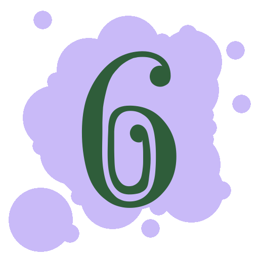

# Simple Open Glyph Generator
These scripts generate a large number of simple, visually distinct, open-license images. You can find the output images in the 'generated images' folder.

After watching [this video by Matt Parker](https://www.youtube.com/watch?v=VTDKqW_GLkw), I was inspired to make my own version of "Myriad Monomatch" using only open-license images.

**Problem:** I need over 10,000 such images to make the cards.

**Solution:** Unicode fonts already contain many visually distinct glyphs. So I multiply several-hundred characters from open-license fonts with a set of backgrounds I made myself.

Varying colors are added as an extra source of visual distinction, but are not themselves used to distinguish between glyphs. That is, there isn't a pair of glyphs with the same background and character.

## Examples

Here are some examples of output from version 2 of the generator, which outputs PNG images.

<table><tr><td>

</td></tr></table>

---

## Licensing and Attribution.

### Images
All generated images in this repo are usable under [CC-BY-4.0](https://creativecommons.org/licenses/by/4.0/), 
meaning you can use them in any way you like as long as you provide attribution and link to the license. 
Something like the following in a readme will suffice:

> Open Glyph Set copyright 2021 Robert Winslow, CC-BY-4.0

_Of course, most of the generated images are things like 'yellow square with a big S on it', and are too simple to individually fall under copyright, but attribution would be appreciated nonetheless._

### Color Schemes Used
- [Paul Tol's colorblind friendly color schemes.](https://personal.sron.nl/~pault/)
- [Paul Centore's conversion of Munsell centroids into RGB](https://www.munsellcolourscienceforpainters.com/ISCCNBS/ISCCNBSSystem.html)

### Fonts used

I've stuck with public domain fonts as the input for this version, and included these fonts [in the repo here](v2-PythonPIL/fonts/), if you'd like to install them yourself. 

In addition to Quivira, V2 also makes use of some goofy public domain fonts by [Typodermic Fonts Inc](https://typodermicfonts.com/public-domain/).

There is one font missing from the font folder, though. In reference to [this XKCD strip](https://xkcd.com/2206/) about "capital numbers", I put together my own rendition, which you can see below. But alas, I know very little about font creation tools. And while I was able to just barely mangle another font enough to replace its letters, the resulting file, `ComputerMavisSerif-Roman_0.ttf`, is currently in too shameful a state to share.

<table><tr><td>

</td></tr></table>

